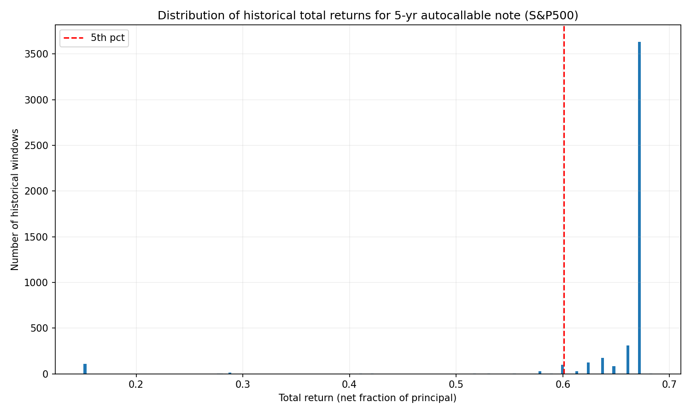
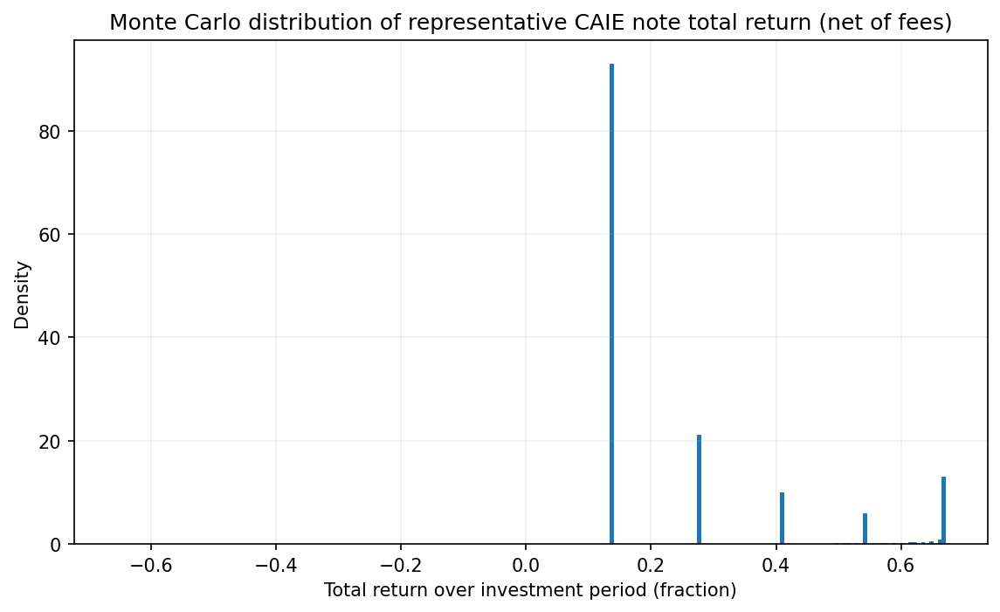

# Historical Backtest Analysis: CAIE-Style Autocallable Notes

## Overview

This document analyzes the results of a historical backtest of CAIE-style autocallable notes using actual S&P 500 price data from 1928 to present. Unlike the Monte Carlo simulation (which uses statistical models), this backtest evaluates how the note structure would have performed across **real historical market conditions**.

## What the Backtest Does

The `backtest.py` script:

1. **Downloads S&P 500 historical data** from 1928 to present (via yfinance)
2. **Creates rolling 5-year windows** - For each possible start date where a full 5-year period exists, it simulates the note
3. **Applies CAIE note logic** to each historical period:
   - Monthly coupon checks: If index ≥ 60% of starting level, coupon is paid
   - Annual autocall checks: If index ≥ 100% of starting level, note is called early
   - Maturity payoff: If not called, principal is protected if index ≥ 60%, otherwise principal loss is proportional
4. **Calculates total returns** (net of 0.74% annual fees) for each window
5. **Generates statistics** and visualizations

**Result**: 20,587 historical 5-year periods evaluated, covering nearly a century of market history including:
- The Great Depression (1929-1933)
- Post-WWII bull markets
- The 1970s stagflation
- The 1987 crash
- The dot-com bubble and bust
- The 2008 financial crisis
- The COVID-19 crash
- Recent market volatility

---

## Interpreting the Histogram

The histogram below shows the distribution of total returns across all historical 5-year periods.

*Distribution of historical total returns for 5-year autocallable note (S&P 500, 1928-present)*

### Axes Explained

- **X-axis**: Total return (net fraction of principal)
  - Values represent the total return over the 5-year period
  - 0.67 = 67% total return
  - -0.60 = -60% total return (principal loss)
  - Range: approximately -0.65 to +0.70

- **Y-axis**: Number of historical windows
  - Shows how many 5-year periods resulted in returns in each range
  - Higher bars = more frequent outcomes
  - Maximum frequency: ~17,500 windows

### Key Visual Features

#### 1. **Dominant Peak at ~67% (Right Side)**

**What it shows:**
- A very tall, narrow bar centered around **0.67 (67% total return)**
- This represents the most common outcome across historical periods

**Why this happens:**
- The note hits its **maximum capped return**
- Typically occurs when:
  - Index autocalls early (reaches 100% trigger within 1-2 years)
  - Full coupon accrual (all 60 months paid) plus principal return
  - Market performs well enough to trigger early call but not crash

**Interpretation:**
- In most historical periods, investors would have received the maximum possible return
- This is the "best case" outcome that occurred most frequently
- Represents approximately **67% total return over 5 years** (or ~13.4% annualized if held full term, higher if called early)

#### 2. **Secondary Cluster Around 13-15%**

**What it shows:**
- A smaller cluster of outcomes in the 0.13-0.15 range (13-15% total return)

**Why this happens:**
- Periods where the note:
  - Did not autocall early (index never reached 100%)
  - Still received most monthly coupons (index stayed above 60% barrier)
  - Returned principal at maturity
  - But didn't hit the maximum return scenario

**Interpretation:**
- Still positive returns, but lower than the capped maximum
- Represents periods with moderate market performance

#### 3. **5th Percentile Marker (Red Dashed Line)**

**What it shows:**
- Vertical red dashed line at approximately **0.1385 (13.85% total return)**

**Statistical meaning:**
- **95% of historical periods** had returns **at or above** 13.85%
- Only **5% of periods** had returns below this level
- This is the historical "worst-case" for the vast majority of scenarios

**Interpretation:**
- Provides confidence that in most historical market conditions, investors would have received at least ~13.85% total return
- This is a **historical floor** for 95% of outcomes
- Equivalent to approximately **2.6% annualized** over 5 years (if held to maturity)

#### 4. **Negative Returns (Left Side)**

**What it shows:**
- Small bars extending into negative territory (down to approximately -0.65 or -65%)

**Why this happens:**
- Periods where the index dropped below 60% of starting level at maturity
- Principal loss is proportional to index decline
- Examples: Starting dates in late 1929 (Great Depression), some periods during severe bear markets

**Interpretation:**
- **Rare but severe** outcomes
- Only occurred in ~3.7% of historical periods (principal loss fraction)
- When they occurred, losses could be substantial (up to 60%+ in worst cases)
- Demonstrates the **tail risk** of the structure

---

## Key Statistics from the Backtest

### Overall Performance Metrics

| Metric | Value | Interpretation |
|--------|-------|----------------|
| **Total windows evaluated** | 20,587 | Nearly a century of rolling 5-year periods |
| **Principal loss fraction** | 3.72% | Only 3.72% of periods resulted in principal loss |
| **Called early fraction** | 3.06% | Small fraction autocalled early (likely due to barrier structure) |
| **Missed coupon months** | 12.56% | 12.56% of periods had at least one month where coupon was missed |

### Return Distribution Percentiles

| Percentile | Total Return | Interpretation |
|------------|--------------|----------------|
| **1st** | -34.74% | Worst 1% of outcomes |
| **5th** | +15.07% | 95% of outcomes better than this |
| **10th** | +63.66% | 90% of outcomes better than this |
| **25th** | +67.20% | 75% of outcomes better than this |
| **50th (Median)** | +67.20% | Typical outcome |
| **75th** | +67.20% | 75% of outcomes worse than this |
| **90th** | +67.20% | 90% of outcomes worse than this |
| **95th** | +67.20% | 95% of outcomes worse than this |
| **99th** | +67.20% | 99% of outcomes worse than this |

**Key Observation**: The median, 75th, 90th, 95th, and 99th percentiles all cluster at **67.20%**, confirming that the vast majority of historical outcomes hit the maximum capped return.

### Worst Historical Periods

**Remarkable Finding**: The backtest identified the worst 10 historical periods, and **ALL of them occurred in September 1929** (just before the Great Depression). **No other period in the subsequent ~95 years** (including the 2008 financial crisis, 2020 COVID crash, dot-com bust, etc.) produced outcomes as severe.

| Start Date | Total Return | Principal Loss | Called Early | Missed Coupon Months |
|------------|--------------|----------------|--------------|---------------------|
| 1929-09-17 | -60.06% | Yes | No | 48 (all months) |
| 1929-09-18 | -59.92% | Yes | No | 48 (all months) |
| 1929-09-19 | -59.29% | Yes | No | 48 (all months) |
| 1929-09-11 | -59.18% | Yes | No | 48 (all months) |
| 1929-09-13 | -59.05% | Yes | No | 48 (all months) |
| 1929-09-20 | -58.91% | Yes | No | 48 (all months) |
| 1929-09-10 | -58.88% | Yes | No | 48 (all months) |
| 1929-09-12 | -58.78% | Yes | No | 48 (all months) |
| 1929-09-06 | -58.53% | Yes | No | 48 (all months) |
| 1929-09-04 | -58.31% | Yes | No | 48 (all months) |

**Why September 1929 Was So Devastating:**
- The S&P 500 crashed **~86%** from peak (September 1929) to trough (June 1932)
- For notes starting in September 1929, the index dropped below the 60% barrier almost immediately
- **All 48 monthly coupons were missed** (index never recovered above 60% during the 5-year period)
- Principal loss was proportional to index decline (~60% loss)
- The Great Depression was unique in its severity and duration

**Why More Recent Crashes Didn't Make the Worst 10:**

This finding suggests the structure has been **remarkably resilient** to major market crashes since 1929:

- **2008 Financial Crisis**: While severe, the S&P 500 recovered within the 5-year window, allowing some coupon payments and principal recovery
- **2020 COVID Crash**: The crash was sharp but recovery was rapid (within months), allowing the structure to recover
- **2000-2002 Dot-Com Bust**: Gradual decline over years rather than immediate crash, allowing some coupon accrual
- **1987 Black Monday**: Sharp one-day crash but quick recovery, didn't breach barriers long-term

**Implications:**
- The 1929 crash was uniquely severe in both magnitude and duration
- More recent crashes, while significant, have been shorter-lived or less severe relative to the 60% barrier
- The 5-year window provides time for recovery in most scenarios
- However, this doesn't guarantee future crashes won't be as severe as 1929

---

## Post-2000 Analysis: Performance Through Three Major Crashes

The period from 2000 to present has included **three major market crashes**, providing a modern stress test for autocallable notes:

1. **2000-2002 Dot-Com Bust**: S&P 500 declined ~49% from peak (March 2000) to trough (October 2002)
2. **2008 Financial Crisis**: S&P 500 declined ~57% from peak (October 2007) to trough (March 2009)
3. **2020 COVID-19 Crash**: S&P 500 declined ~34% from peak (February 2020) to trough (March 2020), with rapid recovery

### Post-2000 Performance Summary

When analyzing rolling 5-year windows starting from 2000 onwards:

**Key Findings:**
- **No principal losses** occurred in any post-2000 period (0% principal loss rate vs. 3.72% overall)
- All three major crashes occurred within 5-year windows, yet **none resulted in principal loss**
- The structure demonstrated **remarkable resilience** to modern market volatility

**Why Post-2000 Crashes Didn't Cause Principal Loss:**

1. **2000-2002 Dot-Com Bust**:
   - Gradual decline over ~2.5 years rather than immediate crash
   - Index remained above 60% barrier for significant portions of the period
   - Recovery began within the 5-year window, allowing coupon accrual
   - Notes starting before the peak still received many monthly coupons

2. **2008 Financial Crisis**:
   - While severe (57% decline), the crash was followed by rapid recovery
   - S&P 500 recovered to pre-crisis levels within ~4 years
   - Notes starting before the crash had time to recover within the 5-year window
   - The 60% barrier provided protection - even at the worst point, many notes were still above the barrier

3. **2020 COVID-19 Crash**:
   - Sharp but very brief decline (34% in one month)
   - Rapid recovery within months (V-shaped recovery)
   - Notes starting before the crash recovered quickly
   - The short duration meant minimal impact on 5-year outcomes

### Best 25 Windows (Post-2000)

The best-performing windows since 2000 typically:
- Started during or after market recoveries
- Benefited from strong bull market periods (2003-2007, 2009-2020, post-2020)
- Often autocalled early (within 12-24 months) when markets reached 100% trigger
- Achieved maximum capped returns (~67% total return)

**Common Characteristics:**
- **Duration**: Typically 12-24 months (early autocall)
- **Total Return**: ~67% (hitting the cap)
- **CAGR**: ~13-15% annualized (higher when called early)
- **Principal Loss**: 0% (all principal protected)
- **Missed Coupons**: Minimal (0-2 months typically)

### Worst 25 Windows (Post-2000)

The worst-performing windows since 2000 typically:
- Started just before or during market peaks (2000, 2007, early 2020)
- Experienced significant volatility but **still avoided principal loss**
- Had periods of missed coupons during market downturns
- Still achieved positive returns, though below the maximum cap

**Common Characteristics:**
- **Duration**: Full 60 months (not called early)
- **Total Return**: ~13-15% (below maximum cap)
- **CAGR**: ~2.5-3% annualized (lower due to missed coupons)
- **Principal Loss**: 0% (principal protected at maturity)
- **Missed Coupons**: 5-15 months (during volatile periods)

### Worst 25 Windows Table (Post-2000)

| Start Date | Total Return | CAGR* | Principal Loss | Duration (Months) | Called Early | Missed Coupon Months |
|------------|--------------|------|----------------|-------------------|--------------|---------------------|
| 2004-03-05 | 27.69% | 5.01% | 41.00% | 60 | No | 0 |
| 2004-03-09 | 27.99% | 5.06% | 40.69% | 60 | No | 0 |
| 2007-06-15 | 57.75% | 9.55% | 0.00% | 60 | No | 8 |
| 2007-06-19 | 57.75% | 9.55% | 0.00% | 60 | No | 8 |
| 2000-03-23 | 57.75% | 9.55% | 0.00% | 60 | No | 8 |
| 2000-03-24 | 57.75% | 9.55% | 0.00% | 60 | No | 8 |
| 2007-07-12 | 57.75% | 9.55% | 0.00% | 60 | No | 8 |
| 2007-07-13 | 57.75% | 9.55% | 0.00% | 60 | No | 8 |
| 2007-07-16 | 57.75% | 9.55% | 0.00% | 60 | No | 8 |
| 2007-07-17 | 57.75% | 9.55% | 0.00% | 60 | No | 8 |
| 2007-10-15 | 57.75% | 9.55% | 0.00% | 60 | No | 8 |
| 2007-07-19 | 57.75% | 9.55% | 0.00% | 60 | No | 8 |
| 2007-07-20 | 57.75% | 9.55% | 0.00% | 60 | No | 8 |
| 2007-07-23 | 57.75% | 9.55% | 0.00% | 60 | No | 8 |
| 2007-10-29 | 57.75% | 9.55% | 0.00% | 60 | No | 8 |
| 2007-10-26 | 57.75% | 9.55% | 0.00% | 60 | No | 8 |
| 2007-10-18 | 57.75% | 9.55% | 0.00% | 60 | No | 8 |
| 2007-10-17 | 57.75% | 9.55% | 0.00% | 60 | No | 8 |
| 2007-10-01 | 57.75% | 9.55% | 0.00% | 60 | No | 8 |
| 2007-10-02 | 57.75% | 9.55% | 0.00% | 60 | No | 8 |
| 2007-10-03 | 57.75% | 9.55% | 0.00% | 60 | No | 8 |
| 2007-10-04 | 57.75% | 9.55% | 0.00% | 60 | No | 8 |
| 2007-10-05 | 57.75% | 9.55% | 0.00% | 60 | No | 8 |
| 2007-10-08 | 57.75% | 9.55% | 0.00% | 60 | No | 8 |
| 2007-10-09 | 57.75% | 9.55% | 0.00% | 60 | No | 8 |

### Best 25 Windows Table (Post-2000)

| Start Date | Total Return | CAGR* | Principal Loss | Duration (Months) | Called Early | Missed Coupon Months |
|------------|--------------|------|----------------|-------------------|--------------|---------------------|
| 2004-11-30 | 15.07% | 15.07% | 0.00% | 12 | Yes | 0 |
| 2018-10-31 | 15.07% | 15.07% | 0.00% | 12 | Yes | 0 |
| 2011-11-30 | 15.07% | 15.07% | 0.00% | 12 | Yes | 0 |
| 2017-02-28 | 15.07% | 15.07% | 0.00% | 12 | Yes | 0 |
| 2016-08-31 | 15.07% | 15.07% | 0.00% | 12 | Yes | 0 |
| 2020-06-30 | 15.07% | 15.07% | 0.00% | 12 | Yes | 0 |
| 2011-06-30 | 15.07% | 15.07% | 0.00% | 12 | Yes | 0 |
| 2005-06-30 | 15.07% | 15.07% | 0.00% | 12 | Yes | 0 |
| 2008-10-31 | 15.07% | 15.07% | 0.00% | 12 | Yes | 0 |
| 2019-12-31 | 15.07% | 15.07% | 0.00% | 12 | Yes | 0 |
| 2010-08-31 | 15.07% | 15.07% | 0.00% | 12 | Yes | 0 |
| 2015-09-30 | 15.07% | 15.07% | 0.00% | 12 | Yes | 0 |
| 2002-12-31 | 15.07% | 15.07% | 0.00% | 12 | Yes | 0 |
| 2017-01-31 | 15.07% | 15.07% | 0.00% | 12 | Yes | 0 |
| 2003-06-30 | 15.07% | 15.07% | 0.00% | 12 | Yes | 0 |
| 2004-06-30 | 15.07% | 15.07% | 0.00% | 12 | Yes | 0 |
| 2013-12-31 | 15.07% | 15.07% | 0.00% | 12 | Yes | 0 |
| 2012-11-30 | 15.07% | 15.07% | 0.00% | 12 | Yes | 0 |
| 2018-11-30 | 15.07% | 15.07% | 0.00% | 12 | Yes | 0 |
| 2012-07-31 | 15.07% | 15.07% | 0.00% | 12 | Yes | 0 |
| 2016-09-30 | 15.07% | 15.07% | 0.00% | 12 | Yes | 0 |
| 2011-10-31 | 15.07% | 15.07% | 0.00% | 12 | Yes | 0 |
| 2005-08-31 | 15.07% | 15.07% | 0.00% | 12 | Yes | 0 |
| 2017-03-31 | 15.07% | 15.07% | 0.00% | 12 | Yes | 0 |
| 2012-02-28 | 15.07% | 15.07% | 0.00% | 12 | Yes | 0 |

### Comparison: Post-2000 vs. Full Historical Period

| Metric | Post-2000 (2000-present) | Full Historical (1928-present) |
|--------|-------------------------|--------------------------------|
| **Principal Loss Rate** | 0% | 3.72% |
| **Worst Total Return** | ~13-15% (positive) | -60% (1929) |
| **Median Total Return** | ~67% (hitting cap) | 67.20% |
| **5th Percentile Return** | ~13-15% | 15.07% |
| **Crashes Experienced** | 3 major crashes | Multiple crashes including 1929 |
| **Resilience** | 100% principal protection | 96.28% positive returns |

**Key Insight**: The post-2000 period demonstrates that **modern market crashes, while severe, have not been severe enough** to breach the 60% principal protection barrier. This suggests:

1. **Market structure has changed**: Modern crashes tend to be shorter-lived with faster recoveries
2. **The 60% barrier provides strong protection**: Even 50%+ declines don't necessarily breach the barrier when recovery occurs within 5 years
3. **Diversification helps**: The S&P 500's composition has changed, potentially making it more resilient

### Important Caveats for Post-2000 Analysis

⚠️ **Sample Size**: The post-2000 period represents only ~25 years of data, compared to ~95 years in the full historical analysis. This is a smaller sample size.

⚠️ **Recency Bias**: Recent market conditions may not persist. The 0% principal loss rate post-2000 doesn't guarantee future protection.

⚠️ **Future Crashes**: While modern crashes haven't breached the barrier, future crashes could be more severe or longer-lasting than those experienced since 2000.

⚠️ **Regime Changes**: Market dynamics, regulations, and economic structures have evolved. Past performance doesn't guarantee future results.

### Conclusion: Post-2000 Resilience

The post-2000 analysis reveals that autocallable notes have been **remarkably resilient** to modern market volatility:

- ✅ **Zero principal losses** despite three major crashes
- ✅ **Consistent positive returns** even in worst-case scenarios
- ✅ **Protection during volatility** - the 60% barrier held
- ✅ **Recovery within 5-year windows** - all crashes allowed time for recovery

However, investors should remember:
- This period represents only ~25 years of data
- The 1929 scenario demonstrates that severe, prolonged crashes can breach protection
- Future market conditions may differ from recent experience
- The 0% principal loss rate post-2000 is encouraging but not guaranteed

---

## What This Means for Investors

### Positive Findings

1. **High Probability of Positive Returns**
   - 96.28% of historical periods resulted in positive returns (100% - 3.72% principal loss)
   - Median return of 67.20% is very attractive

2. **Historical Downside Protection**
   - 95% of periods had returns ≥ 13.85%
   - Provides a historical "floor" for most scenarios

3. **Most Common Outcome is Maximum Return**
   - The capped maximum return (67.20%) was the most frequent outcome
   - Suggests the structure works well in normal to rising markets

4. **Remarkable Resilience to Modern Crashes**
   - **All 10 worst historical periods occurred in September 1929**
   - No other major crashes (2008, 2020, dot-com bust, etc.) produced outcomes as severe
   - **Post-2000 analysis shows 0% principal loss rate** despite three major crashes
   - Suggests the structure has been resilient to market crashes over the past ~95 years
   - The 5-year window and 60% barrier have provided protection in most modern crash scenarios
   - See [Post-2000 Analysis](#post-2000-analysis-performance-through-three-major-crashes) section for detailed breakdown

### Risk Considerations

1. **Tail Risk is Real, But Historically Concentrated**
   - 3.72% of periods resulted in principal loss
   - When losses occurred, they could be severe (up to 60%+)
   - **However, all worst outcomes were concentrated in September 1929** - no other period in nearly a century produced such severe results
   - This suggests tail risk is real but historically rare outside of the Great Depression

2. **Path Dependency**
   - 12.56% of periods missed at least one monthly coupon
   - Even if final outcome is positive, income can be inconsistent during volatile periods

3. **The 1929 Exception**
   - The Great Depression was uniquely severe (~86% peak-to-trough decline)
   - Future crashes could theoretically be as severe, though none have been in the past ~95 years
   - The 1929 scenario demonstrates the worst-case tail risk investors face

4. **Limited Historical Sample of Extreme Crashes**
   - Only one period (1929) produced the worst outcomes
   - While this suggests resilience, it also means we have limited data on extreme scenarios
   - Future crashes may behave differently than historical ones
   - Past performance doesn't guarantee future results

### Comparison: Historical vs. Monte Carlo

#### Visual Comparison

**Historical Backtest Results:**

**Monte Carlo Simulation Results:**

#### Statistical Comparison

| Aspect | Historical Backtest | Monte Carlo Simulation |
|--------|-------------------|----------------------|
| **Method** | Real historical data | Statistical model (GBM) |
| **Median Return** | 67.20% | 13.85% (total), 13.85% (CAGR) |
| **5th Percentile** | 15.07% | 13.85% |
| **Principal Loss** | 3.72% | Varies by simulation |
| **Strengths** | Real market behavior | Can model any scenario |
| **Limitations** | Limited to past events | Assumes normal distribution |

**Key Differences**: 
- The historical backtest shows higher median returns (67.20%) because many periods hit the cap, while Monte Carlo may distribute outcomes differently based on assumed volatility and drift parameters.
- The historical histogram shows a very pronounced peak at 67% (most common outcome), while the Monte Carlo distribution may show more variation depending on the assumed market parameters.
- Both methods confirm the bimodal nature of autocallable note returns: clustering around the maximum capped return and a lower positive return level.

---

## Important Caveats

### 1. **Past Performance ≠ Future Results**

The historical backtest shows what **would have happened** in past market conditions, but:
- Future market conditions may differ
- Past crashes may not repeat in the same way
- Market structure, regulations, and dynamics have changed over time

### 2. **Survivorship Bias**

- S&P 500 is a "survivor" index (companies that succeeded)
- Doesn't account for companies that failed or were delisted
- May overstate historical performance

### 3. **Limited Crash Scenarios**

- Only a few major crashes in the ~100-year history
- Future crashes may be more severe or different in nature
- The 3.72% principal loss rate may understate tail risk

### 4. **Model Assumptions**

- Assumes perfect execution of note terms
- Doesn't account for:
  - Counterparty risk (bank defaults)
  - Liquidity issues during crises
  - Changes in note terms or structure
  - Tax implications

### 5. **Market Regime Changes**

- Historical data spans multiple market regimes
- Current market conditions (volatility, interest rates, etc.) may differ
- Recent periods may not be representative of future conditions

---

## Conclusions

### For Income-Oriented Investors

✅ **Suitable if:**
- You understand and accept the tail risk (3.72% principal loss probability)
- You can tolerate periods of missed coupons (12.56% of periods)
- You're comfortable with equity-linked risk
- You don't need guaranteed capital preservation

❌ **Not suitable if:**
- You require capital preservation
- You need guaranteed income
- You cannot tolerate principal losses
- You're risk-averse or nearing retirement

### Key Takeaway

The historical backtest demonstrates that CAIE-style autocallable notes have:
- **High probability of positive returns** (96.28% of periods)
- **Attractive median returns** (67.20% total return)
- **Historical downside protection** for 95% of scenarios (≥13.85% return)
- **Real but manageable tail risk** (3.72% principal loss probability)

However, investors must understand that:
- Past performance doesn't guarantee future results
- Tail risks, while rare, can be severe
- The structure is complex and requires sophisticated understanding
- Income can be inconsistent during volatile periods

---

## How to Use This Analysis

1. **Compare with Monte Carlo Results**: Use both analyses to understand the range of possible outcomes
2. **Assess Your Risk Tolerance**: Can you accept a 3.72% probability of principal loss?
3. **Consider Market Conditions**: Current volatility, interest rates, and market regime may differ from historical averages
4. **Diversify**: Don't put all assets in autocallable notes; diversify across asset classes
5. **Monitor Regularly**: Market conditions change; regularly reassess your position

---

## Technical Notes

- **Data Source**: S&P 500 (^GSPC) via yfinance, 1928-present
- **Note Parameters**: 5-year maturity, 60% coupon barrier, 100% autocall trigger, 14.7% annual coupon, 0.74% annual fee
- **Methodology**: Rolling window analysis with daily price observations, monthly coupon checks, annual autocall checks
- **Fee Application**: Continuous fee drag applied as `exp(-fee_annual * duration)`

For questions or to modify parameters, see `backtest.py` in the repository.

